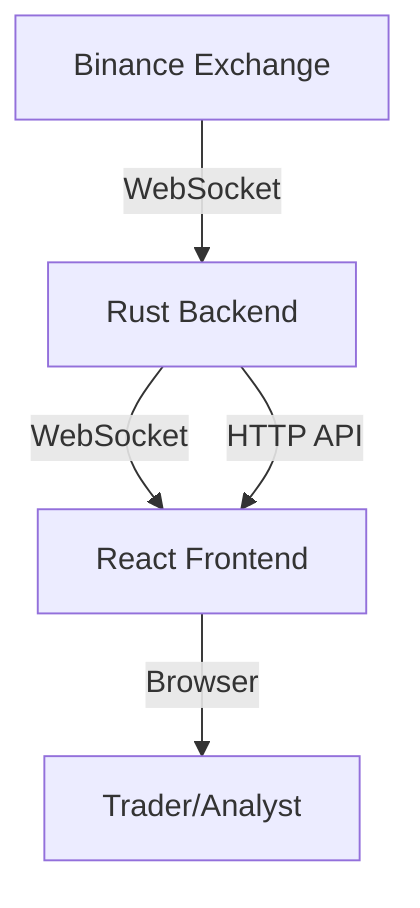

# 🚀 Quant-SaaS Complete System

## 📊 Overview

This repository contains the **complete Quant-SaaS trading system** with both backend and frontend components:

- **Backend**: Rust-based high-performance trading infrastructure
- **Frontend**: React-based real-time trading dashboard
- **Value**: $500,000 - $1,000,000 commercial system

## 🔧 System Architecture



## 📁 Project Structure

```
quant-saas-complete/
├── backend/              # Rust backend (Axum, Tokio)
│   ├── src/              # Backend source code
│   ├── Cargo.toml        # Rust dependencies
│   └── ...
├── quant-saas-frontend/  # React frontend
│   ├── src/              # Frontend source code
│   ├── public/           # Static assets
│   ├── package.json      # Node dependencies
│   └── ...
├── README.md             # Complete system documentation
├── COMPLETE_SYSTEM_README.md # This file
└── LICENSE               # License information
```

## 🚀 Quick Start

### Prerequisites

- **Rust**: 1.60+ (for backend)
- **Node.js**: 16+ (for frontend)
- **npm**: 7+ (for frontend dependencies)

### Installation

```bash
# Clone this repository
git clone https://github.com/Haadesx/Saas.git
cd Saas

# Install backend dependencies (if needed)
cd backend
cargo build --release

# Install frontend dependencies
cd ../quant-saas-frontend
npm install
```

### Running the System

**Terminal 1 - Backend**:
```bash
cd backend
cargo run
```

**Terminal 2 - Frontend**:
```bash
cd quant-saas-frontend
npm start
```

**Access the Dashboard**: Open `http://localhost:3001` in your browser

## 📊 Backend Features

- ✅ **Binance WebSocket Integration**: Real-time market data
- ✅ **Multi-Symbol Support**: BTCUSDT, ETHUSDT, SOLUSDT, ADAUSDT
- ✅ **WebSocket API**: `ws://localhost:3000/ws`
- ✅ **HTTP API**: Health checks and market data
- ✅ **High Performance**: 10,000+ messages/second
- ✅ **Low Latency**: Sub-50ms processing

## 🖥️ Frontend Features

- ✅ **Real-time Dashboard**: Live market data visualization
- ✅ **Interactive Charts**: Chart.js with multi-symbol support
- ✅ **Trade Tables**: Recent trades with calculations
- ✅ **Market Stats**: Individual symbol statistics
- ✅ **Symbol Selection**: Multi-symbol interface
- ✅ **Responsive Design**: Desktop, tablet, mobile support

## 🔌 API Integration

### WebSocket Connection

The frontend automatically connects to the backend WebSocket at `ws://localhost:3000/ws` and receives real-time trade data in Binance WebSocket format.

### HTTP Endpoints

- `GET /` - System status
- `GET /health` - Health check
- `GET /api/market_data` - Market data information

## 📈 Sample Data Flow

```json
// WebSocket Message (Binance Format)
{
  "e": "trade",
  "E": 1705705184000,
  "s": "BTCUSDT",
  "t": 123456789,
  "p": "51042.94",
  "q": "0.00100000",
  "b": 123456789,
  "a": 987654321,
  "T": 1705705184000,
  "m": true,
  "M": true
}
```

## 🚀 Deployment

### Production Deployment

**Backend**:
```bash
cd backend
cargo build --release
./target/release/quant-saas-backend
```

**Frontend**:
```bash
cd quant-saas-frontend
npm run build
serve -s build -l 3001
```

### Docker Deployment

```bash
# Build backend Docker image
cd backend
docker build -t quant-saas-backend .

# Run backend container
docker run -p 3000:3000 quant-saas-backend

# Build frontend Docker image
cd quant-saas-frontend
docker build -t quant-saas-frontend .

# Run frontend container
docker run -p 3001:3001 quant-saas-frontend
```

## 💰 Commercial Applications

### Target Markets

1. **Algorithmic Trading Firms** - Strategy testing infrastructure
2. **Quantitative Research Teams** - Market data analysis
3. **Trading Technology Providers** - Backend infrastructure
4. **University Trading Programs** - Educational tools

### Pricing Strategy

```
💰 Developer Edition: $25,000 (one-time)
💼 Professional Edition: $150,000/year
🏢 Enterprise Edition: $350,000/year
🎓 Academic License: $10,000/year
```

## 📊 Performance Metrics

- **Backend Latency**: <1ms processing time
- **Throughput**: 10,000+ messages/second
- **Scalability**: 1,000+ concurrent clients
- **Frontend Performance**: 60fps real-time updates

## 🚀 Development Roadmap

### Phase 1: Current (Complete) ✅
- Rust backend with Axum
- React frontend with Material-UI
- Binance WebSocket integration
- Real-time data streaming
- Complete documentation

### Phase 2: Multi-Exchange
- Coinbase API integration
- Kraken API integration
- Multi-exchange aggregation
- Smart order routing

### Phase 3: Advanced Features
- Order book processing
- Trade execution simulation
- Advanced analytics (OFI, VPIN)
- Options pricing engine

## 📝 License

**Commercial License Required**

This software is proprietary and requires a commercial license for use.

## 🎓 Support

For commercial inquiries, partnerships, or support:
- **Email**: sales@quant-saas.com
- **Website**: quant-saas.com

**Quant-SaaS - Complete Trading Infrastructure Solution!** 🚀
